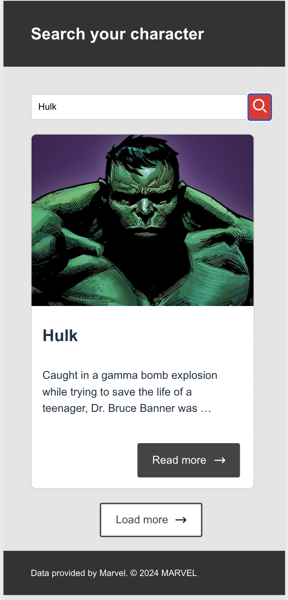
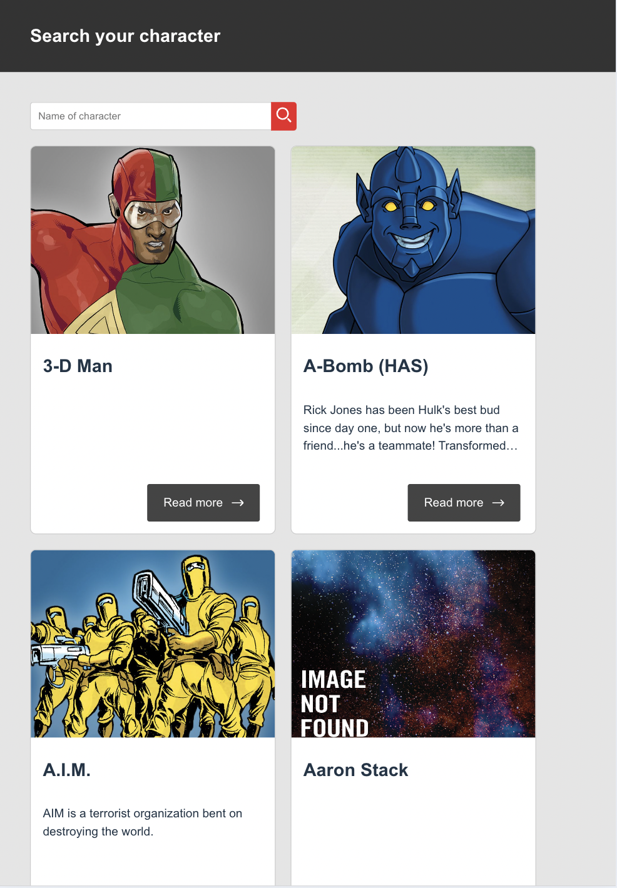
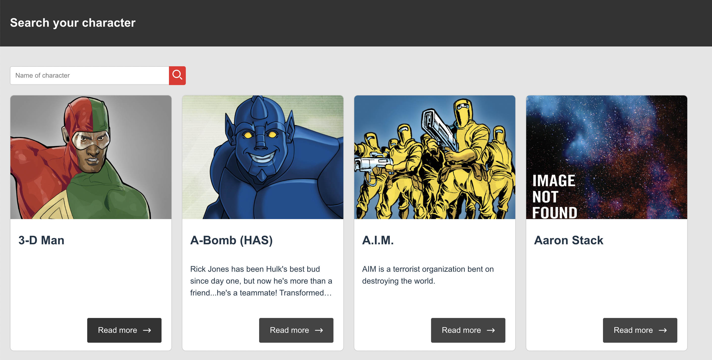

# Marvel Character Search Project

This project is a character search application for the Marvel universe, utilizing the public Marvel API. You can find more information about the Marvel API [here](https://developer.marvel.com/).

## Technologies Used

This project is built using [Vite](https://vitejs.dev/), [React](https://reactjs.org/), and [TypeScript](https://www.typescriptlang.org/). 
Vite was chosen for its fast development server and build times compared to webpack. Additionally, TypeScript was chosen for its type safety and enhanced development experience.

## Getting Started

To initialize the project, follow these steps:

1. Install dependencies:

```sh
 npm install
```

2. Create .env file
Create a .env file in the root directory of the project and add the following environment variables:
```sh
VITE_API_BASE_URL=https://gateway.marvel.com/
VITE_MARVEL_API_PUBLIC_KEY=ff17cffb2b811e80f15c2613539b4a62
VITE_MARVEL_API_PRIVATE_KEY=b9b32515f281767d4e9c0a9a66c177ae0644135a
```


3. Start the development server:
```sh
npm run start
```
This will start the server at port 3000.

### Running Unit Tests
To run the unit tests, use the following command:

```sh
npm run test
```

### Running Cypress Tests
This project includes [Cypress](https://www.cypress.io/) tests to cover certain scenarios, such as searching for characters, and ensures thorough testing of all application use cases. To run Cypress tests, use the following command:

```sh
npm run cypress
```
This will open Cypress in the Chrome browser.

## Screenshots

### Mobile


### Tablet Results


### Character Desktop


## Acknowledgments
Special thanks to Stayforlong for providing the opportunity to work on this technical test!